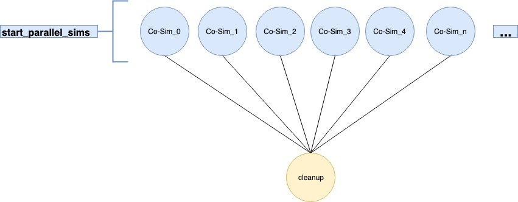

# Monte Carlo Simulation using Merlin

This tutorial will walk through how to setup a HELICS Monte Carlo simulation
using Merlin. We assume that you have already completed the
orchestration tutorial [here](orchestration.md) and have some
familiarity on how Merlin works.

We will walk through how to user Merlin to setup and run a HELICS
Monte Carlo simulation. Code for the Monte Carlo simulation and the
full Merlin spec and be found [here](<link to the code on github>)

# EV Charging Monte Carlo Co-simulation
<Blurb about Monte Carlo sims>

# Merlin spec for Co-Simulation
In this specification we will be using the
[helics_cli](https://github.com/GMLC-TDC/helics-cli) to execute each
Co-Simulation run since this is a Monte Carlo simulation. This means
that helics_cli will be executed multiple times with different
helics_cli runner files. 

## Helics_cli in Merlin

Since we are using the helics_cli to manage and execute all the
federates, we need to create these runner files for helics_cli.
There is a provided python script called `make_samples.py` that will
generate the runner file and a csv file that will be used in the
study step.

An example of how the helics_cli runner file looks like is shown
below.

```
Example of helics_cli runner for UQ EV example
```

As you can see from the example there are 3 federates 1 for the
EVMsgFed.py, 1 for the EVControllerMsgFed.py and 1 for the HELICS
broker. Helics_cli will start each of these federates. In the Merlin
spec, Merlin will be instructed to execute the helics_cli with all the
generated helics_cli runner files.

## Merlin Specification

### Environment

In the Merlin spec we will instruct Merlin to execute N number of the
Monte Carlo co-simulations. The number of samples is the number
specified as the `N_SAMPLES` env variable in the env section of the
merlin spec.

```
env:
  variables:
    OUTPUT_PATH: ./UQ_EV_Study
    N_SAMPLES: 10	
```

We set the ouput directory to UQ_EV_Study, this is where all the
output files will be stored. Every co-simulation run executed by
merlin will have it's own subdirectory in `./UQ_EV_Study`.

### Merlin Step

Remeber this step is for Merlin to setup all the files and data it
needs to execute it's jobs. In the Monte Carlo co-simulation there is
a python script we created that will generated the helics_cli runner
files that Merlin will use when it executes the helics_cli. The
`make_samples.py` script will also output a csv file that Merlin will
use. The csv file contains all the names of the runner files. Merlin
will go down this list of file names and execute the helics_cli for
each file name.

```
merlin:
  samples:
    generate:
      cmd: |
        python3 $(SPECROOT)/make_samples.py $(N_SAMPLES) $(MERLIN_INFO)
        cp $(SPECROOT)/EVMsgFed.py $(MERLIN_INFO)
        cp $(SPECROOT)/EVControllerMsgFed.py $(MERLIN_INFO)
    file: $(MERLIN_INFO)/samples.csv
    column_labels: [FED]

```

The samples the get generated should look something like below. This
is the runner file that helics_cli will use to start the
co-simulation.

```
{
    "federates": [
        {
            "directory": ".",
            "exec": "helics_broker --federates=2 --loglevel=5 --type=tcpss --port 12345",
            "host": "broker",
            "name": "broker_0",
            "loglevel": 3
        },
        {
            "directory": ".",
            "exec": "python3 EVMsgFed.py --port 12345 --seed 1",
            "host": "broker",
            "name": "EVMsgFed_0",
            "loglevel": 3
        },
        {
            "directory": ".",
            "exec": "python3 EVControllerMsgFed.py --port 12345",
            "host": "broker",
            "name": "EVController_0",
            "loglevel": 3
        }
    ],
    "name": "Generated by make samples"
}
```

Once the samples have been created, we copy the 2 federates to the
`MERLIN_INFO` directory.

### Study Step

We have made it to the study step. This step will execute all 10 Monte
Carlo co-simulations. There are 2 steps in the study step. The first
step is the `start_parallel_sims` step. This step will use the
helics_cli to execute each co-simulation. The second step, `cleanup`
depends on the first step. Once `start_parallel_sims` is complete the
`cleanup` step will remove any temporary data that is no longer
needed.

```

study:
    - name: start_parallel_sims
      description: Run a bunch of UQ sims in parallel
      run:
        cmd: |
          spack load helics
          /home/yee29/projects/helics/helics-cli/bin/helics run --path=$(MERLIN_INFO)/$(FED)
          echo "DONE"
    - name: cleanup
      description: Clean up
      run:
        cmd: rm $(MERLIN_INFO)/samples.csv
        depends: [start_parallel_sims_*]
```

Below is what the DAG of the Merlin study will look like. Each of the
Co-Sim_n bubbles represents the Monte Carlo simulation. Each co-sim
runs in parallel with each other since there is no dependency on the
output that each co-sim runs.




